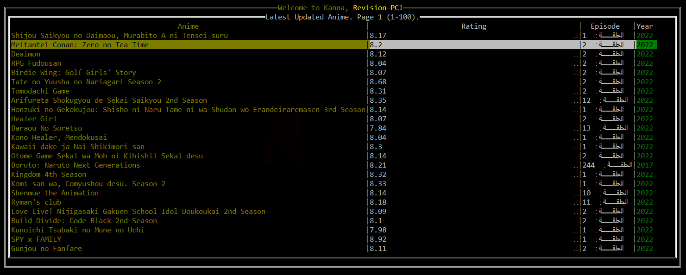
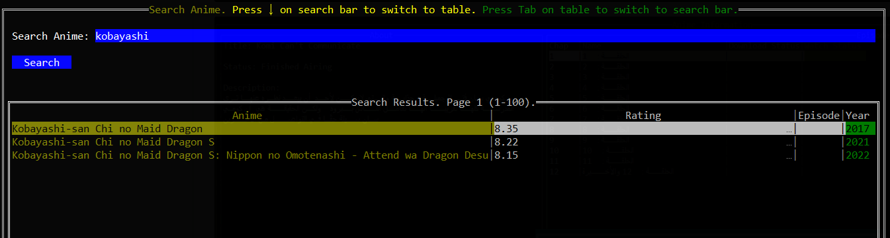
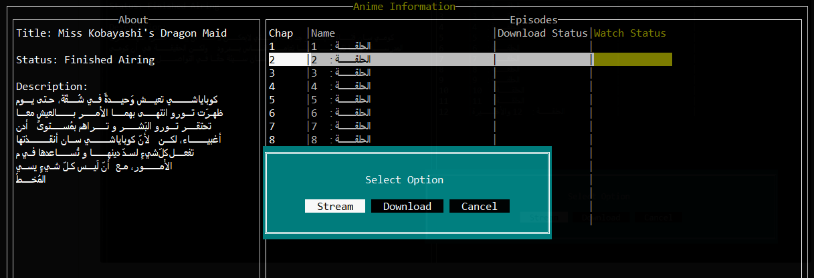

# kanna

kanna is an cli app to watch/Download Arabic anime with a single button with no annoying ADs
Also it allow multi episodes selection for bulk download :)

# Showcase

# NOTICE
the app doesn't have a proper documentation yet and it's not available for public usage yet waiting to continue working on that project once I am free from university projects. But I see it necessary to have credits at least for now so thanks to
https://github.com/darylhjd/mangadesk I took lot of code from there with modification and added more stuff to fit my needs.
